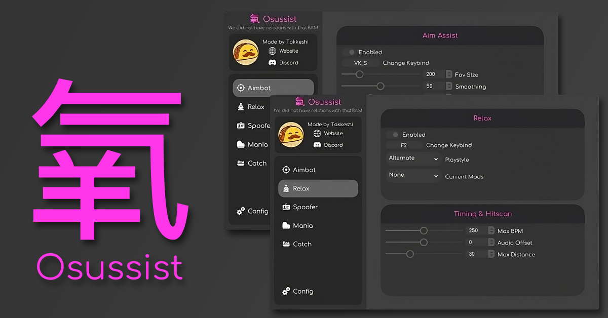
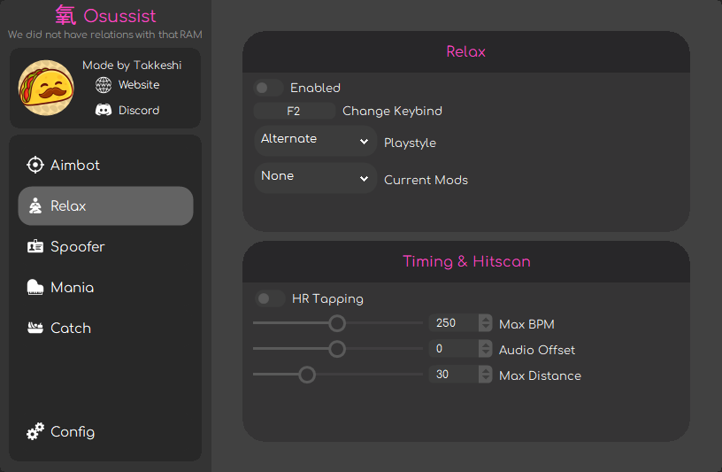
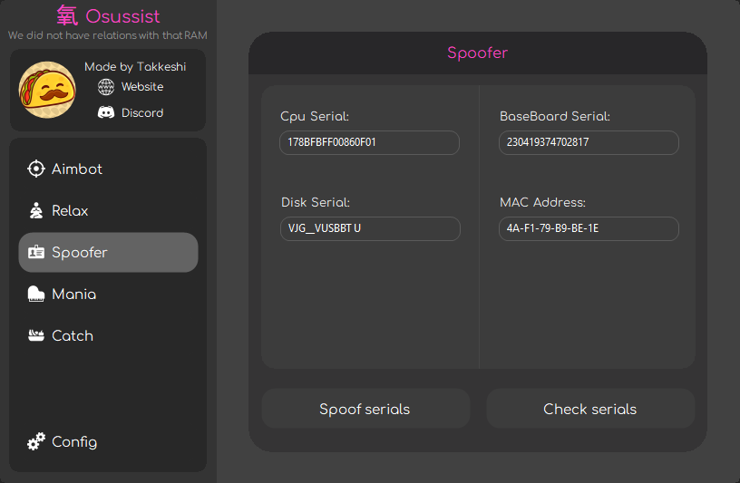
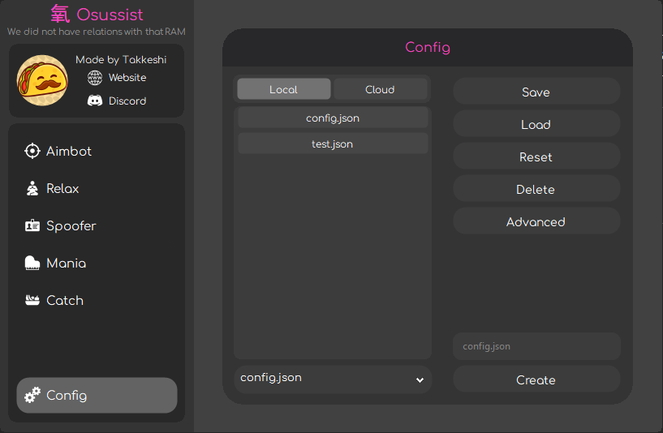

# Osussist

The best (and only) free tool that provides real-time aim assistance, tap assistance, and ban bypassing for the rhythm game osu. It is fully undetectable by the osu anti-cheat and open-source, so you can see how it works and even make it better if you want.

  

## Our Features

This is the current feature list, with much more to come!

- [x] Universal Aim Assist
  - [x] Stable Compat
  - [x] Lazer Compat
- [x] Semi-Legit Relax
  - [x] Stable Compat
  - [ ] Lazer Compat
- [x] Built-in Spoofer
  - [x] Temp Spoof
  - [ ] Perm Spoof
- [ ] Osu!Mania Bot
  - [x] Stable Compat
  - [ ] Lazer Compat
- [ ] Osu!Catch Bot
  - [x] Stable Compat
  - [ ] Lazer Compat
- [ ] Cloud Configs

## Showcase

Little showcase of the current menu features!

  

  

  

  

