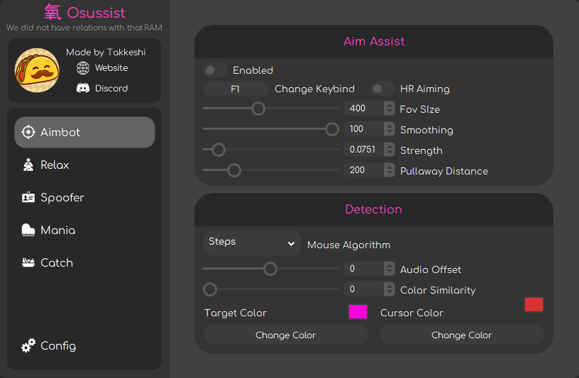

# Osussist

The best (and only) free tool that provides real-time aim assistance, tap assistance, and ban bypassing for the rhythm game osu. It is fully undetectable by the osu anti-cheat and open-source, so you can see how it works and even make it better if you want.

  

## Our Features

This is the current feature list, with much more to come!

### Main Binary (Everyone)
- [x] Universal Aim Assist
  - [x] Stable Compat
  - [x] Lazer Compat
- [x] Semi-Legit Relax
  - [x] Stable Compat
  - [ ] Lazer Compat
- [x] Built-in Spoofer
  - [x] Temp Spoof
  - [ ] Perm Spoof
- [ ] Osu!Mania Bot
  - [x] Stable Compat
  - [ ] Lazer Compat
- [ ] Osu!Catch Bot
  - [x] Stable Compat
  - [ ] Lazer Compat
- [ ] Config System
  - [x] Local Configs
  - [ ] Cloud Configs

### Installer (Everyone)
- [x] Auto-Install
- [ ] User Accounts
- [x] Built-in Changelogs

### Account Generator (Donator)
- [x] Low Quality Accounts 
- [x] High Quality Accounts
- [x] Ultra High Quality Accounts

## Showcase

Little showcase of the current menu and its features!
### Videos

  

### Images

  

  

  

  

